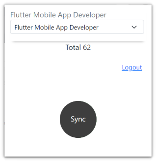
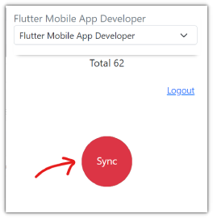

# Naukri Extension
___
This Extension is used to fetch resumes meta data from Naukri.com portal in one go 

## Features
- Fetch all relevant profile resumes meta data from naukri.com in one go
- Select profiles to fetch resumes based on your preferences eg: Vue, Node, HR etc.
- Auto save preferred profiles
- Fetch recent new resumes from the portal
- Auto detection of the correct page via extension

Installation
------------
 Via Chrome Web Store
 * TBD.
 

Via Local file .zip ( Load unpacked )
 * Click on the _three dot_ menu on the top right corner of your browser (chrome / edge)
 * Navigate to the following menus
 ```
 (in Google Chrome) More tools > Extensions
 (in Microsoft Edge) Extensions
 ```
 * Toggle _ON_ **Developer mode**
    - (in Google Chrome) on the top right corner of Extensions page
    - (in Microsoft Edge) on the bottom left corner of Extensions page
 * Click **Load unpacked** button and select the folder having _NAUKRI EXTENSION_ files
 * You will see the Extension installed on the same page
 * Check and turn _ON_ the toggle of the installed _NAUKRI EXTENSION_ extension
    - (in Google Chrome) on the bottom right corner
    - (in Microsoft Edge) on the top right corner
 * (in Google Chrome) click on the puzzle piece icon beside three dot vertical menu on the top right corner
 * (in Google Chrome) find the _NAUKRI EXTENSION_ from the list and click on the pin icon
 * (in Google Chrome) now you might be able to see the _NAUKRI EXTENSION_ beside the puzzle piece icon


Usage
------------
* Login to recruit.naukri.com and go to https://rms.naukri.com/admin/homePage

* _NAUKRI EXTENSION_ icon will change its color 
* Click on the _NAUKRI EXTENSION_ icon, enter your login credentials if you see login screen 
* If you are fetching resumes for the first time using _NAUKRI EXTENSION_ set back it will take quite some time depending on your internet speed :)
* 
* After the loading is finished, You will see following:-
    - List of profiles fetched in dropdowns
    - Total number of resumes fetched 
    - 
* You can check and see if any of the dropdown has more than 1 value, feel free to select the appropriate one.
* Selected dropdown value will be saved and on the next consecutives run it will be pre selected, you can change it if you want to
* Once all dropdown are selected, click on **SYNC** button you see at the bottom.
* Once all resumes are successfully sent the **SYNC** button will turn into  green color 
* If in case something went wrong **SYNC** button will turn into  red color 


Troubleshooting
------------
 * After you have already **SYNC** once and the **loading** is taking unusual long time, check the following:
   - Click on the _NAUKRI EXTENSION_ icon to close it, and click again to repoen it. 
   - Close the current browser **TAB** and repoen it.
   - Try clearing your browser cache **Hard Reload**
   - Try closing the browser and repoen it

  * **SYNC** button turned into  red color
    - Click on the _NAUKRI EXTENSION_ icon to close it, and click again to repoen it. 
    - There might be some API errors, you may contact admin as well

FAQ
---

Q: Does this _NAUKRI EXTENSION_ works on any other job portal ?
A: No, not at the moment!


## Designed and developed by
Excellence Technologies (https://excellencetechnologies.in/)